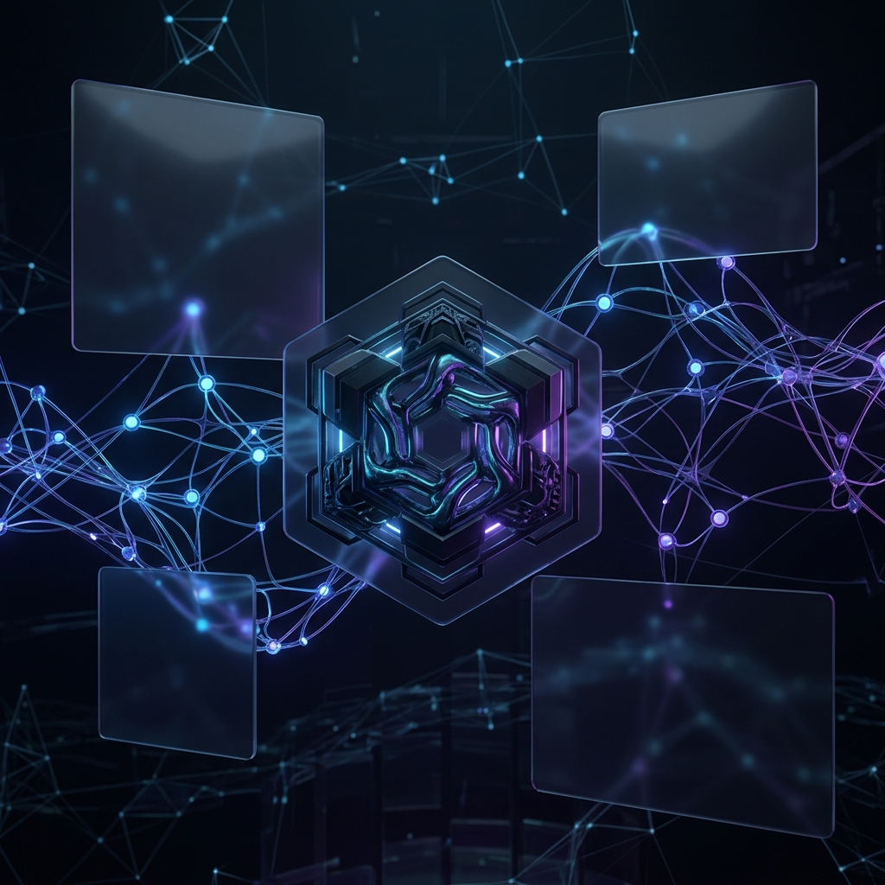
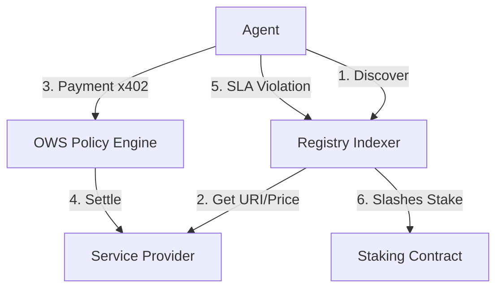
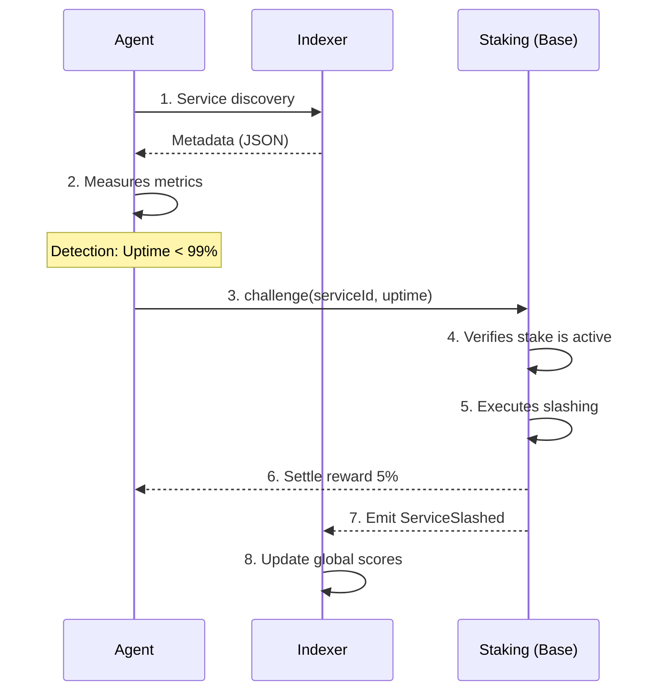

# ⬡ x402 Universal Service Registry

**OWS Hackathon 2026 · Grand Prize Entry**

The x402 Universal Service Registry is a decentralized, coordinate discovery layer for autonomous agents. It provides a staked, slashable registry where providers list API capabilities, and agents discover/pay via x402 micropayments.



---

## 🚀 Vision
In the era of autonomous multi-agent systems, agents need a trustless way to discover, evaluate, and transition between service providers without human intervention. The x402 Registry serves as the coordination primitive that makes this possible.

---

## 🔥 Key Features
- **Staked Quality Bonds**: Providers stake ETH/USDC backing their SLA uptime targets.
- **Trustless Slashing**: Any agent can challenge a provider claim. Proof of SLA violation leads to automatic on-chain stake slashing.
- **x402 Micropayments**: Instant, sub-second settlement for per-query API calls via OWS wallets.
- **Multi-Chain Discovery**: Native on **Base Sepolia**, indexing services across 9 chains.
- **Responsive Dashboard**: Premium dark-mode interface for monitoring global call volume and slash events.

---

## ⛓️ Smart Contract
The registry logic is fully on-chain.
- **Network**: Base Sepolia
- **Address**: `0xc0a6c9684318264a17b685a347df148D04F165fA`
- **Verifier**: [BaseScan ↗](https://sepolia.basescan.org/address/0xc0a6c9684318264a17b685a347df148D04F165fA)

---

## 🛠️ Technology Stack
- **Frontend**: React + Vite (Tailwind + Recharts)
- **Styling**: Vanilla CSS (Glassmorphism design system)
- **Blockchain**: Solidity (Hardhat + Ethers.js)
- **Storage**: SQLite + Node.js (Metadata Index)
- **Standards**: x402, OWS Micropayments

---

## ⚡ Quick Start

### 1. Requirements
- Node.js 18+
- MetaMask (Base Sepolia)

### 2. Installation
```bash
# Clone and install
git clone https://github.com/shivamsoni20/X402-registry-master-prompt
npm install
```

### 3. Setup Environment
Create a `.env` file in the root:
```env
PRIVATE_KEY=your_private_key
VITE_CHAIN_MODE=simulation # Use 'live' for real contract interaction
```

### 4. Commands
```bash
# Development server (Frontend + Backend)
npm run dev

# Compile Contracts
npx hardhat compile

# Deploy to Base Sepolia
npm run deploy:sepolia
```

---

## 🗺️ Architecture Overview
---

## 🗺️ Architecture Overview


---

## 🛠️ Trustless SLA Enforcement


---

## 🏆 OWS Hackathon 2026
This project addresses the **Infrastructure Coordination** grant, providing the necessary discovery primitive for the OWS ecosystem to move beyond static API keys into dynamic, trustless agent economies.

---

**Built with <3 by shivam**
